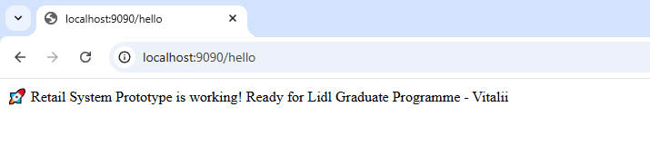
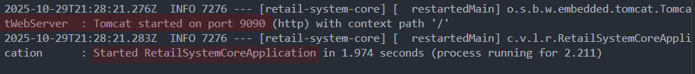

# Spring Boot Retail System Prototype

## Project Status: SUCCESS
Spring Boot application successfully running with REST API endpoint!

### Features:
- Spring Boot 3.5.7 with Java 17
-  REST API endpoint (`/hello`)
- H2 Database configured
- Spring Data JPA ready
- Maven build system

### How to Run:
1. Clone repository
2. Run: `./mvnw spring-boot:run`
3. Visit: `http://localhost:9090/hello`

### Technologies:
- Java 17, Spring Boot, H2 Database
- Spring Data JPA, Maven, Git

##  Demo Screenshots
### Spring Boot Application Running:

### Working REST API:

